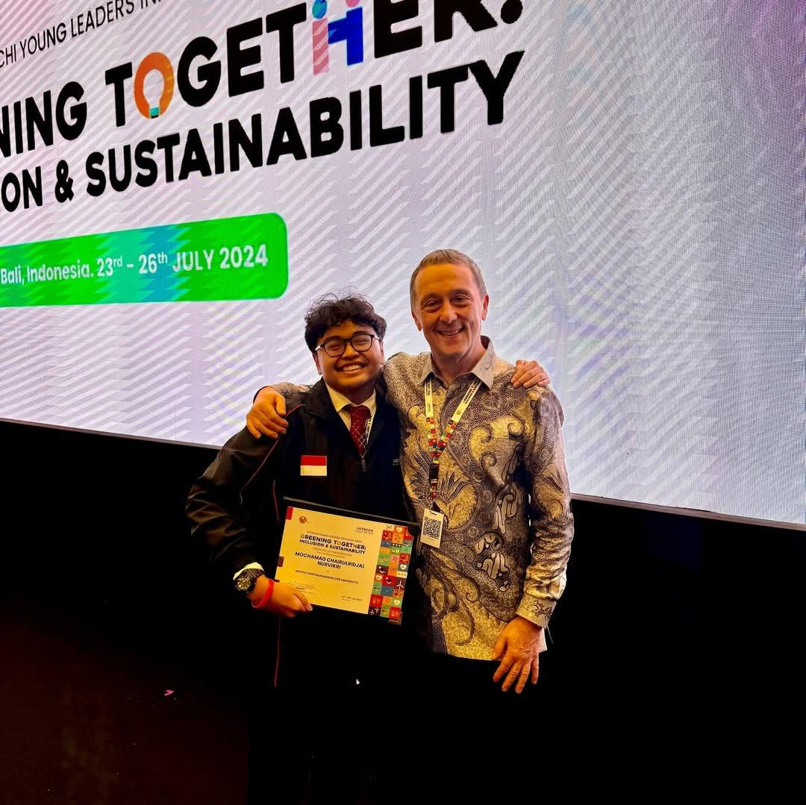
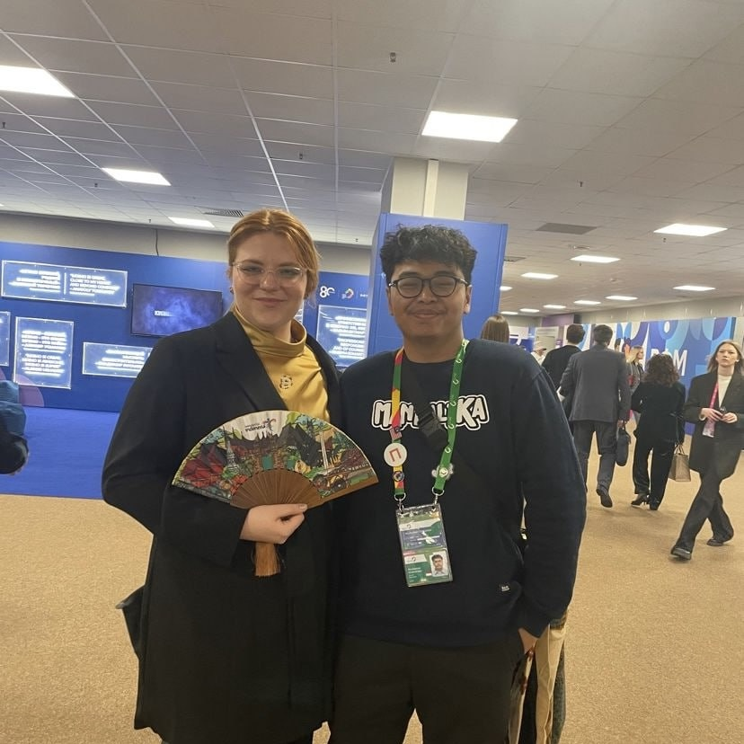
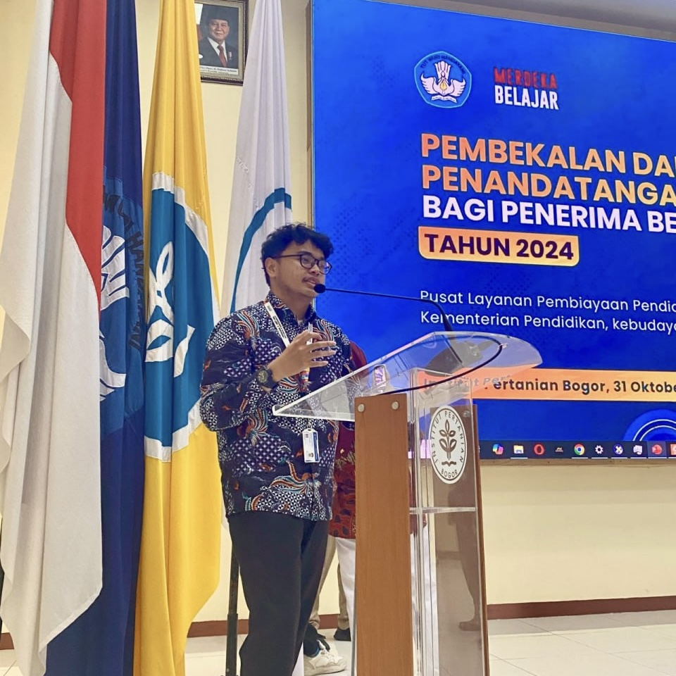

# 🌞 Mochamad Chairulridjal Nurvikri  

**`Building the future where code meets climate.`** ⚙️🌱  

Hey there! I’m **Ridjal**, a computer science student at **IPB University**, renewable energy advocate, and currently **President of IEEE Student Branch IPB University**. I love creating things that make a difference — from writing code that powers ideas, to building communities that bring technology closer to humanity. My journey revolves around **sustainability, AI, and clean energy** — blending logic with purpose, and curiosity with impact.  

  
  
  
  

---

<table align="center">
  <tr>
    <td align="center" width="25%">
       
      <b>Renew Our Power</b> 
      Brazil, 2025 - Renewable Energy.
    </td>
    <td align="center" width="25%">
       
      <b>Hitachi Young Leaders</b> 
      Bali, 2024 - SDG 7 policy & tech.
    </td>
    <td align="center" width="25%">
       
      <b>World Youth Festival</b> 
      Russia, 2024 - Youth Forum.
    </td>
    <td align="center" width="25%">
       
      <b>Beasiswa Unggulan</b> 
      Indonesia - National scholarship.
    </td>
  </tr>
</table>

---

### 💡 Featured Projects  

| Project | Description | Tech Stack |
|----------|--------------|-------------|
| [**KalaNusa**](https://github.com/chairulridjaal/kalanusa) | AI app preserving Indonesian cultural heritage through OCR and storytelling. | Python, OpenCV, FastAPI |
| [**HerdSphere**](https://github.com/chairulridjaal/herdsphere) | Livestock tracking app with multi-farm support. | Firebase, React Native |
| [**InvoiceChainAgent**](https://github.com/chairulridjaal/invoicechainagent) | AI & blockchain system for invoice validation and fraud detection. | Python, Fetch.ai, ICP, GPT-4o |

---

### ⚙️ Technical Skills

<table role="presentation" width="100%" style="width:100%; border-collapse:separate; border-spacing:24px 16px; border:0;">
  <tr>
    <td align="center" width="50%" style="border:0; padding:0;">
      <h4>🤖 AI / ML & Data</h4>
      

        
        
        
        
        
        
      

      Python · TensorFlow · PyTorch · Pandas · NumPy · Jupyter
    </td>
    <td align="center" width="50%" style="border:0; padding:0;">
      <h4>💻 Frontend & UI</h4>
      

        
        
        
        
        
        
      

      React · Next.js · TypeScript · Tailwind · JavaScript · Vite
    </td>
  </tr>
  <tr>
    <td align="center" width="50%" style="border:0; padding:0;">
      <h4>⚙️ Backend & Database</h4>
      

        
        
        
        
        
      

      Node.js · Express · Firebase · PostgreSQL · MongoDB
    </td>
    <td align="center" width="50%" style="border:0; padding:0;">
      <h4>🛠️ Tools & Platforms</h4>
      

        
        
        
        
        
        
        
      

      Git · Docker · AWS · Vercel · Linux · VS Code · Figma
    </td>
  </tr>
</table>

--

### 📊 GitHub Stats  

  

---

### 🎵 Currently Listening To  

  
*(good code starts with a good playlist)* 🎧  

---

### 🧩 What Drives Me  

I’m deeply passionate about using technology to build a cleaner, fairer future.  From **community-based solar projects** to **AI-powered sustainability tools**, I believe innovation means little unless it creates impact that lasts. I lead with the same purpose that guides IEEE — *Advancing Technology for Humanity* — and I hope every line of code I write contributes to that mission.

---

### 🌱 Let’s Collaborate  

If your mission aligns with sustainability, AI, or open-source impact — let’s connect. Together, we can **advance technology for humanity.** 💚  
